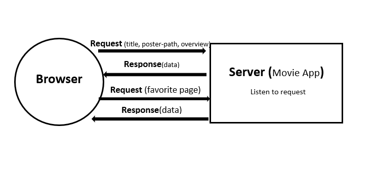
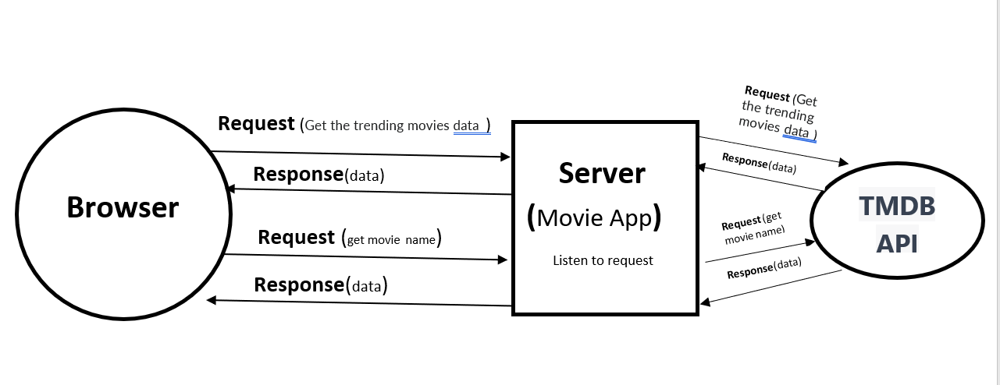
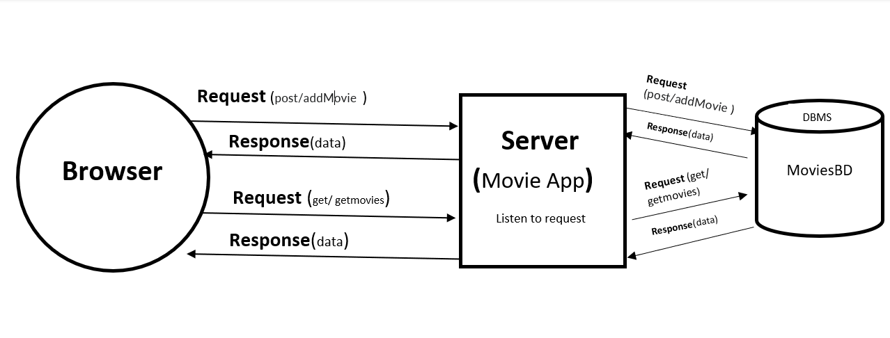
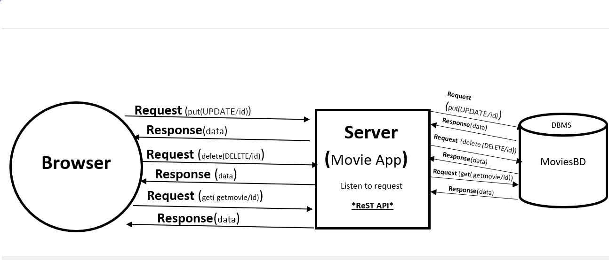

# Movies-Library
# Project Name - Project Version
**Movies-Library** Version 1.3.0

**Author Name**: Ghofran Jamal Daradkh

## WRRC
LAB11

LAB12

LAB13

LAB14

## Overview
**Movies-Libraries** are of utmost importance because they provide a diverse range of films for entertainment, preserve culture and heritage, and facilitate access to movies. Libraries offer comprehensive information about the films, including their titles, authors, and more, making them easily accessible to the public.
NOW , we deal with Third-party API TMDB ,which can work and servers  together to enable communication and data exchange between each other.

## Getting Started
<!-- What are the steps that a user must take in order to build this app on their own machine and get it running? -->
Set up your development environment that is mean install the required software and tools and necessary runTime (Node.js)
Import or install required module through node pakage manger **npm** like "express" ,"cores" ,"axios","dotenv"
we use express to start building server , axios we use it to send or deal with data from another APIs,
and the doenv to make me able to read dotenv file which is the file use to hide some data from pushing on github.

Create server which will listen to Browser request,When a request is made from a browser to a server that interacts with a third-party API, the browser initiates the request by sending an HTTP request(this request includes the HTTP method (e.g.get), the URL of API endpoint.) to the server. The server acts as a mediator, receiving the request and handling any necessary authentication or authorization processes. It then constructs an appropriate request to the third-party API, and sends it. The third-party API processes the request, performs the requested actions, and generates an HTTP response. The response flows back through the server, which may perform additional processing or transformations before delivering the final response to the browser. 
Then Set up the database.
Test and run the app.

LAB 13 :
NOW , the browser acts as the client and initiates a request by sending an HTTP request (get,post)to the server. The server receives the request and handles it, establishing a connection with the database,The server formulates SQL queries based on the request and sends them to the database for execution. The database processes the queries, retrieves or modifies the data as needed, and generates a response.The server receives the response,  and sends it back to the browser as an HTTP response.

LAB14 :
NOW , the browser acts as the client and initiates a request by sending an HTTP request(get,put ,delete) to the server.
we can send data by in three ways :request body (POST or PUT) or as query parameters(req.params) or query string(req.query).then  The server receives the request and handles it, establishing a connection with the database,The server formulates SQL queries based on the request and sends them to the database for execution. The database processes the queries, retrieves or updated or deleted the data as needed, and generates a response.The server receives the response,  and sends it back to the browser as an HTTP response.

## Project Features
<!-- What are the features included in you app -->
For a movies library app, here are some features you may consider including: 
in the future:
Movie Catalog:Provide a comprehensive catalog of movies, including details like title,genre_ids,language and overview 
User Registration:Allow users to create accounts and log in to access .
NOW:
Show all movies by get movies we can see all movies in library.
Add Movie :we can add new movies to the catalog .
Update movies : you can update data of movies if you want .
Delete movies : you can delete any movie you want .
